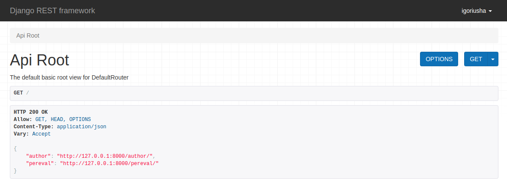
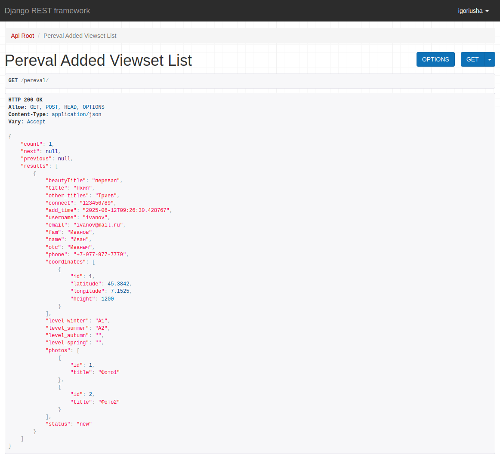
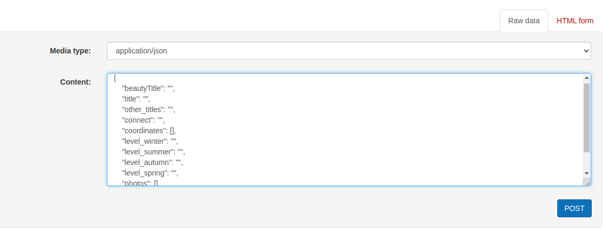
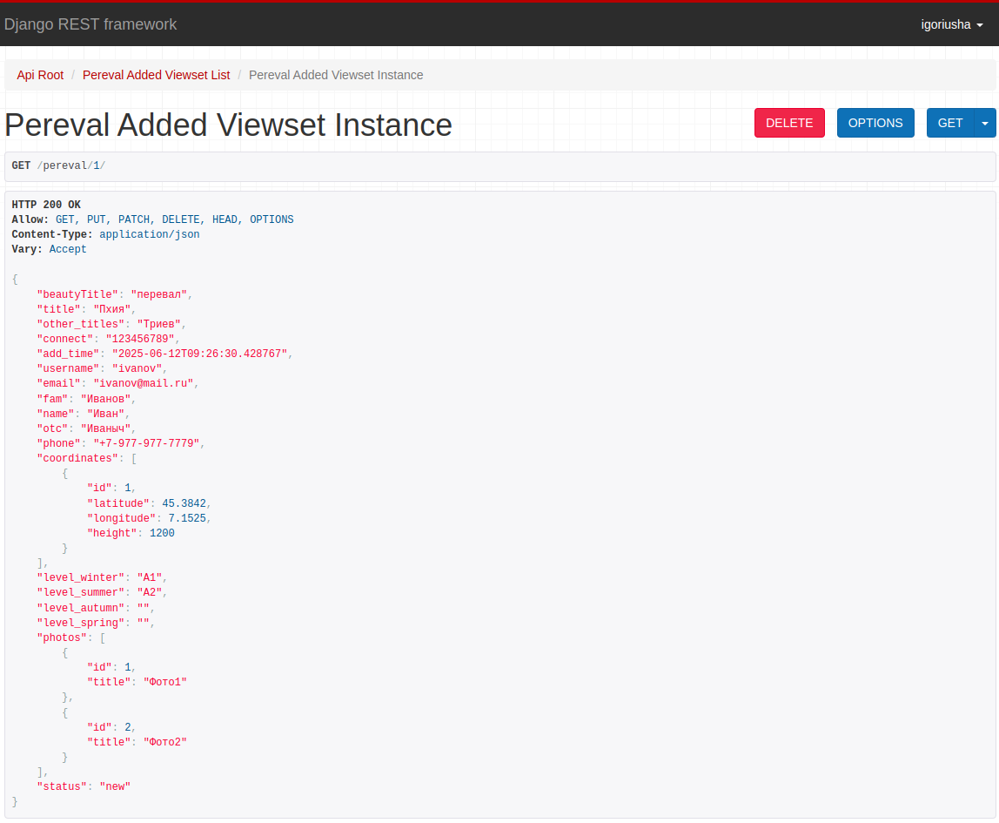

# Документация к проекту VirtualInternship
## Этот проект представляет собой REST API, разработанный с использованием Django и Django REST Framework. 
## Он позволяет пользователям выполнять CRUD (создание, чтение и обновление) операции для данных о перевале.
## Заказчик: Федерации Спортивного Туризма России.

## Инструкция к работе над проектом
### Основные инструменты:

- Python 3.12
- Django
- Django REST Framework
- База данных (PostgreSQL)

# 1. Установка и зависимости
## requirements.txt
```text
asgiref==3.8.1
django==5.2.2
django-filter==25.1
djangorestframework==3.16.0
drf-yasg==1.21.10
inflection==0.5.1
markdown==3.8
packaging==25.0
Pillow==11.2.1
psycopg2==2.9.10
python-dotenv==1.0.1
pytz==2025.2
pyyaml==6.0.2
sqlparse==0.5.3
uritemplate==4.2.0
```
### 1.1. Клонируйте репозиторий и перейдите в рабочую директорию:
```bash
git clone https://github.com/IgorVolostnov/VirtualInternship.git
cd perevalapi
```
### 1.2. Установите зависимости из файла `requirements.txt`:

```bash
pip install -r requirements.txt
```

### 1.3. Создайте виртуальное окружение для проекта:

```bash
python -m venv env
```

Активируйте виртуальное окружение:

- **Для Windows:**

  ```bash
  .\env\Scripts\activate
  ```

- **Для macOS/Linux:**

  ```bash
  source env/bin/activate
  ```


### 1.4. Настройка базы данных 

Создайте базу данных, выполнив команду в терминале:

```commandline
createdb -U postgres <имя бд> 
```

В файле settings.py настройте конфигурацию
```python
import os

DATABASES = {
    'default': {
        'ENGINE': 'django.db.backends.postgresql',
        'NAME': os.environ.get('NAME_PORTAL', ''),
        'USER': os.environ.get('USER_PORTAL', ''),
        'PASSWORD': os.environ.get('PASSWORD_PORTAL', ''),
        'HOST': os.environ.get('HOST_PORTAL', ''),
        'PORT': os.environ.get('PORT_PORTAL', ''),
    }
}
```
Создайте файл .env по следующему образцу в дериктории perevalapp
```text
SECRET_KEY_DJANGO = '<секретный код Django>'
PORT_DJANGO = '<порт Django>'
NAME_PORTAL = '<имя базы данных>'
USER_PORTAL = '<пользователь базы данных>'
PASSWORD_PORTAL = '<пароль пользователя>'
HOST_PORTAL =  '<хост базы данных>'
PORT_PORTAL = '<порт базы данных>'
```
### 1.5. Примените необходимые миграции

```commandline
python manage.py migrate
```
### 1.6. Создайте пользователя для получения токена.

```commandline
python manage.py createsuperuser
```
### 1.7. Запустите сервер 

```commandline
python manage.py runserver
```
# 2 Сервер будет доступен по адресу:
http://127.0.0.1:8000/
# 3 Запросы CRUD
###  Все запросы вы можете выполнить по ссылке на документацию API SWAGGER:
http://127.0.0.1:8000/swagger/
## 3.1 Работа с перевалами
### Получить все перевалы:
#### Все запросы вы можете выполнить без аутентификации
[GET http://127.0.0.1:8000/pereval/](http://127.0.0.1:8000/pereval/)
```text
curl -X 'GET'
  'http://127.0.0.1:8000/pereval/'
  -H 'accept: application/json'
```
#### Ответ в формате json
```json
{
  "count": 1,
  "next": null,
  "previous": null,
  "results": [
    {
      "beautyTitle": "перевал",
      "title": "Пхия",
      "other_titles": "Триев",
      "connect": "123456789",
      "add_time": "2025-06-12T09:26:30.428767",
      "username": "ivanov",
      "email": "ivanov@mail.ru",
      "fam": "Иванов",
      "name": "Иван",
      "otc": "Иваныч",
      "phone": "+7-977-977-7779",
      "coordinates": [
        {
          "id": 1,
          "latitude": 45.3842,
          "longitude": 7.1525,
          "height": 1200
        }
      ],
      "level_winter": "А1",
      "level_summer": "А2",
      "level_autumn": "",
      "level_spring": "",
      "photos": [
        {
          "id": 1,
          "title": "Фото1"
        },
        {
          "id": 2,
          "title": "Фото2"
        }
      ],
      "status": "new"
    }
  ]
}
```

### Создать новый перевал
[POST http://127.0.0.1:8000/pereval/](http://127.0.0.1:8000/pereval/)
#### Структура в формате json
```json
{
  "beautyTitle": "string",
  "title": "string",
  "other_titles": "string",
  "connect": "string",
  "coordinates": [
    {
      "id": 0,
      "latitude": 0,
      "longitude": 0,
      "height": 0
    }
  ],
  "level_winter": "string",
  "level_summer": "string",
  "level_autumn": "string",
  "level_spring": "string",
  "photos": [
    {
      "id": 0,
      "title": "string"
    }
  ],
  "status": "new"
}
```

### Получить конкретный перевал
[GET http://127.0.0.1:8000/pereval/{id}/](http://127.0.0.1:8000/pereval/{id}/)
#### Ответ в формате json
```json
{
    "beautyTitle": "перевал",
    "title": "Пхия",
    "other_titles": "Триев",
    "connect": "123456789",
    "add_time": "2025-06-12T09:26:30.428767",
    "username": "ivanov",
    "email": "ivanov@mail.ru",
    "fam": "Иванов",
    "name": "Иван",
    "otc": "Иваныч",
    "phone": "+7-977-977-7779",
    "coordinates": [
        {
            "id": 1,
            "latitude": 45.3842,
            "longitude": 7.1525,
            "height": 1200
        }
    ],
    "level_winter": "А1",
    "level_summer": "А2",
    "level_autumn": "",
    "level_spring": "",
    "photos": [
        {
            "id": 1,
            "title": "Фото1"
        },
        {
            "id": 2,
            "title": "Фото2"
        }
    ],
    "status": "new"
}
```

### Обновить перевал
[PUT http://127.0.0.1:8000/pereval/{id}/](http://127.0.0.1:8000/pereval/{id}/)
[PATCH http://127.0.0.1:8000/pereval/{id}/](http://127.0.0.1:8000/pereval/{id}/)
#### Структура, ограничения и допустимые значения в формате json
```text
HTTP 200 OK
Allow: GET, PUT, PATCH, DELETE, HEAD, OPTIONS
Content-Type: application/json
Vary: Accept
```
```json
{
    "name": "Pereval Added Viewset Instance",
    "description": "",
    "renders": [
        "application/json",
        "text/html"
    ],
    "parses": [
        "application/json",
        "application/x-www-form-urlencoded",
        "multipart/form-data"
    ],
    "actions": {
        "PUT": {
            "beautyTitle": {
                "type": "string",
                "required": true,
                "read_only": false,
                "label": "Красивое название",
                "max_length": 255
            },
            "title": {
                "type": "string",
                "required": true,
                "read_only": false,
                "label": "Название",
                "max_length": 255
            },
            "other_titles": {
                "type": "string",
                "required": true,
                "read_only": false,
                "label": "Другое название",
                "max_length": 255
            },
            "connect": {
                "type": "string",
                "required": false,
                "read_only": false,
                "label": "Соединение",
                "max_length": 255
            },
            "add_time": {
                "type": "datetime",
                "required": false,
                "read_only": true,
                "label": "Время добавления"
            },
            "username": {
                "type": "field",
                "required": false,
                "read_only": true,
                "label": "Username"
            },
            "email": {
                "type": "field",
                "required": false,
                "read_only": true,
                "label": "Email"
            },
            "fam": {
                "type": "field",
                "required": false,
                "read_only": true,
                "label": "Fam"
            },
            "name": {
                "type": "field",
                "required": false,
                "read_only": true,
                "label": "Name"
            },
            "otc": {
                "type": "field",
                "required": false,
                "read_only": true,
                "label": "Otc"
            },
            "phone": {
                "type": "field",
                "required": false,
                "read_only": true,
                "label": "Phone"
            },
            "coordinates": {
                "type": "field",
                "required": true,
                "read_only": false,
                "label": "Coordinates",
                "child": {
                    "type": "nested object",
                    "required": true,
                    "read_only": false,
                    "children": {
                        "id": {
                            "type": "integer",
                            "required": true,
                            "read_only": false,
                            "label": "Id"
                        },
                        "latitude": {
                            "type": "float",
                            "required": false,
                            "read_only": false,
                            "label": "Широта перевала"
                        },
                        "longitude": {
                            "type": "float",
                            "required": false,
                            "read_only": false,
                            "label": "Долгота перевала"
                        },
                        "height": {
                            "type": "integer",
                            "required": false,
                            "read_only": false,
                            "label": "Высота перевала",
                            "min_value": -2147483648,
                            "max_value": 2147483647
                        }
                    }
                }
            },
            "level_winter": {
                "type": "string",
                "required": false,
                "read_only": false,
                "label": "Уровень зимой",
                "max_length": 255
            },
            "level_summer": {
                "type": "string",
                "required": false,
                "read_only": false,
                "label": "Уровень летом",
                "max_length": 255
            },
            "level_autumn": {
                "type": "string",
                "required": false,
                "read_only": false,
                "label": "Уровень осенью",
                "max_length": 255
            },
            "level_spring": {
                "type": "string",
                "required": false,
                "read_only": false,
                "label": "Уровень весной",
                "max_length": 255
            },
            "photos": {
                "type": "field",
                "required": true,
                "read_only": false,
                "label": "Photos",
                "child": {
                    "type": "nested object",
                    "required": true,
                    "read_only": false,
                    "children": {
                        "id": {
                            "type": "integer",
                            "required": true,
                            "read_only": false,
                            "label": "Id"
                        },
                        "title": {
                            "type": "string",
                            "required": true,
                            "read_only": false,
                            "label": "Название изображения"
                        },
                        "images": {
                            "type": "image upload",
                            "required": true,
                            "read_only": false,
                            "label": "Изображение",
                            "max_length": 100
                        }
                    }
                }
            },
            "status": {
                "type": "choice",
                "required": false,
                "read_only": false,
                "label": "Статус",
                "choices": [
                    {
                        "value": "new",
                        "display_name": "Новый"
                    },
                    {
                        "value": "pending",
                        "display_name": "В работе"
                    },
                    {
                        "value": "accepted",
                        "display_name": "Успешно"
                    },
                    {
                        "value": "rejected",
                        "display_name": "Отказано"
                    }
                ]
            }
        }
    }
}
```

# Заключение

## Данная документация описывает основные функции, доступные в данном API. 
## За дополнительной информацией обращайтесь к коду проекта или задавайте вопросы разработчику.
### Волостнов Игорь Сергеевич
### E-mail: visfin@yandex.ru
